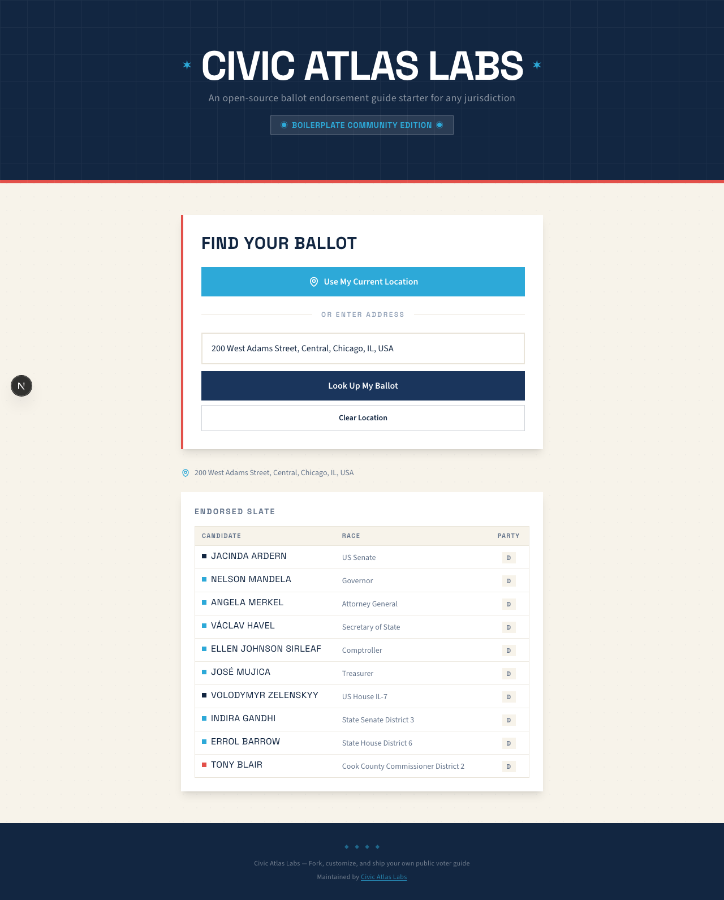

# Ballot Endorsement Guide

[](https://github.com/MisterClean/ballot-endorsement-guide/actions/workflows/ci.yml)
[](./LICENSE)
[](https://nodejs.org/)

Headless, self-hostable ballot endorsement lookup for civic organizations.

Given an address or coordinates, the app resolves district layers from your configured map pack and returns your matching endorsed slate.

<p align="center">
  
</p>

## Features

- Single-tenant deployment model (one org per instance)
- Configurable branding and jurisdiction metadata
- Layer-driven district map packs under `frontend/data/district-maps/<state-slug>/...`
- Pluggable geocoding providers:
  - geocode.earth
  - Mapbox
  - Google Maps (Places API New + Geocoding v4beta)
  - Geoapify
- Shareable lookup URLs with `?lat=<...>&lng=<...>`
- Docker + Railway deployment support

## Quick Start

```bash
git clone https://github.com/<your-org>/ballot-endorsement-guide.git
cd ballot-endorsement-guide/frontend
npm install
npm run dev
```

Open `http://localhost:3000`.

## Configure For Your Organization

The fastest way to get started is with the **`fork-and-customize` Claude Code skill**. If you have [Claude Code](https://docs.anthropic.com/en/docs/claude-code) installed, run:

```
/fork-and-customize
```

The skill walks you through branding, jurisdiction setup, district maps, endorsements, geocoding provider selection, deployment, and testing — all interactively.

### Manual setup

1. Update `frontend/src/lib/app-config.ts` (org branding + jurisdiction settings).
2. Choose a geocoder in `frontend/src/lib/app-config.ts`.
3. Set only the matching API credential in runtime env vars.
4. Add/update district maps in `frontend/data/district-maps/<state-slug>/...`.
5. Map layer IDs in `frontend/src/lib/app-config.ts` under `districtMapPack.layers`.
6. Update endorsements in `frontend/data/endorsements.yaml`.

District GeoJSON files included in this repo are kept as sample data for Illinois.

## Environment Variables

Set a provider and one matching provider key:

- `GEOCODING_PROVIDER` with one of: `geocode-earth`, `mapbox`, `google-maps`, `geoapify`

- `GEOCODE_EARTH_API_KEY` for `geocode-earth`
- `MAPBOX_ACCESS_TOKEN` for `mapbox`
- `GOOGLE_MAPS_API_KEY` for `google-maps`
- `GEOAPIFY_API_KEY` for `geoapify`

Do not commit `.env` files.

## Tests And Quality

```bash
cd frontend
npm run lint
npm test
npm run test:fast
```

## API Endpoints

- `GET /api/lookup?address=<...>` or `GET /api/lookup?lat=<...>&lng=<...>`
- `GET /api/autocomplete?q=<...>`
- `GET /api/reverse?lat=<...>&lng=<...>`
- `GET /api/health`

## Deployment

### Docker

```bash
docker build -t ballot-endorsement-guide .
docker run -p 3000:3000 ballot-endorsement-guide
```

### Railway (recommended)

This repo includes `railway.toml` and Docker-based deploy config.

- Healthcheck path: `/api/health`
- Configure env vars in Railway service settings:
  - `GEOCODING_PROVIDER=<your-provider>`
  - the matching provider API key (for example `GEOCODE_EARTH_API_KEY=...`)

To run a community showcase deployment without touching `main`:

1. Push a dedicated branch (for example `showcase/community-demo`).
2. In Railway, create a separate service or project connected to this repo and set its source branch to that showcase branch.
3. Set `GEOCODING_PROVIDER` to match your private tenant deployment (for example `geocode-earth`) and set the same API key variable used there.
4. Deploy and verify `/api/health` returns `200`.

## Open-Source Launch Checklist

- Set repository description to: `Open-source, self-hostable ballot endorsement guide.`
- Enable branch protection on `main`.
- Enable Dependabot security updates.
- Create an initial tag/release (`v0.1.0`).
- Confirm CI passes on default branch.

## License

MIT. See `LICENSE`.
